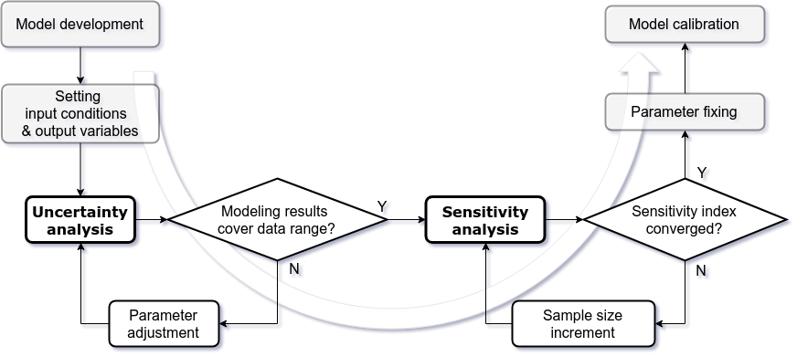

# Introduction

Sensitivity analysis (SA) is a mathematical technique to investigate how variations in model parameters affect model outputs [@saltelli2008global]. An increasing number of studies use SA to determine which model parameters contribute to high variation in model predictions [@ferretti2016trends]. This technique has also been applied in pharmacology and toxicology research [@loizou2015application; @mcnally2012reconstruction]. Pharmacokinetic models describe the changes in the concentrations or amounts of a substance in the body over time (the various terms for the kinetic models, including "pharmacokinetic", "toxicokinetic", and "biokinetic" models, are used exchangeably here). The goal of SA in pharmacokinetic research is to examine the sensitivity of output variables, such as chemical concentration in blood or tissues, with respect to input parameters, such as anatomical, physiological, and kinetic constants [@mcnally2011workflow]. In addition, this SA approach can guide experimental design and the parameter estimation processes [@zhang2015sobol]. For instance, SA can identify "unidentifiable" parameters that can lead to problems with numerical procedures used in parameter estimation [@chu2010quantitative]. It can be further applied to parameter prioritization and parameter fixing before model calibration [@fphar201800588].

In our earlier work [@fphar201800588], we developed an updated workflow to apply global SA to reduce the computational burden in the Bayesian, Markov Chain Monte Carlo (MCMC)-based calibration process of a physiologically based pharmacokinetic (PBPK) model. We used \pkg{GNU MCSim} [@JSSv002i09], an effective simulation package for Bayesian population PBPK modeling, to calibrate the model. We found that the extended Fourier Amplitude Sensitivity Test (eFAST), a type of variance-based global SA algorithm, had the best balance of efficiency and accuracy for a sophisticated, multi-compartment, multi-dataset, and multi-metabolite PBPK model. This method was first introduced in @cukier1973study (the classic FAST method with the first-order effect only) in a study of the sensitivity of coupled reaction systems that are constructed by differential equations with the numerous rate coefficients. It then evolved to estimate the Sobol' sensitivity measure in @saltelli1999quantitative (the eFAST method with first- and total-order effects). The FAST algorithm creates the multidimensional space of input parameters through a "search-curve". It is more computationally efficient in calculating the influence of model parameter than other global SA methods such as the Monte Carlo based approaches [@jansen1999analysis; @owen2013better]. Our previous work also found some efficient visualization approaches that can be used to distinguish between “influential” and “non-influential” parameters. This approach addresses common identifiability issues of PBPK model parameter that increase the computational burden of Bayesian analysis [@garcia2015identifiability], and therefore reduce the computational efficiency. We also developed approaches for communicating parameter sensitivity in decision making.

Most of SA tools are constructed using scientific computing software, such as \proglang{GNU Octave}/\proglang{Matlab} [@pianosi2015matlab], \proglang{python} [@herman2017salib], and \proglang{R} [@iooss2017introduction]. The \proglang{R} software is widely used and includes numerous developed packages, such as \pkg{sensitivity} [@R-sensitivity], which is a practical tool to conduct local and global SA. The \pkg{sensitivity} package includes some functions to generate the parameter sequences by using different computing algorithms. Also, it provides a feasible way to integrate external modeling results. This computational approach can effectively solve the heavy computing burden of numerical solutions within the pure \proglang{R} environment. Several other \proglang{R} packages, such as \pkg{FME}, \pkg{multisensi}, and \pkg{ODEsensitivity} include SA tools and are freely available in the Comprehensive R Archive Network (CRAN). The \pkg{FME} package contains a basic method for performing local SA for dynamic models [@JSSv033i03]. It can also conduct collinearity and identifiability analysis to evaluate which model parameters can estimate or exclude based on available observation data. The \pkg{multisensi} package provides SA for models with multivariate output [@R-multisensi]. \pkg{ODEsensitivity} can perform SA in ordinary differential equation (ODE) models [@R-ODEsensitivity]. It utilizes the ODE interface from the \pkg{deSolve} package and connect it with the SA from the \pkg{sensitivity} package. Other related packages such as \pkg{mtk} [@RJ-2015-031] and \pkg{fast} [@R-fast] are designed to investigate the importance of model parameter. 

Although these tools provide various approaches to perform SA, they each individually have limitations for application to pharmacokinetic and PK modeling. For example, the estimated index in SA is not robust when using the inadequate size of the sample number. However, there are no software packages that provide the available tools in the assessment of reliability. In addition, the existing eFAST function does not include the feature to generate the random sampling curve. We present here an \proglang{R} package, called \pkg{pksensi}, which is designed to make SA more accessible and reproducible in pharmacological and toxicological researches. This package can investigate both parameter uncertainty and sensitivity in pharmacokinetic and PK model with multivariate model outputs. Moreover, it seamlessly integrates with both general ODE solvers available in R or as external \proglang{C} code, as well as the \pkg{GNU MCSim} software used for conducting sophisticated PK modeling, including MCMC. The analytical framework in \pkg{pksensi} includes not only global SA but also the uncertainty analysis and diagnostic tools to support the modeling process. The design concepts of \pkg{pksensi} are:  

*	Cross-platform: Models can run on Windows/MacOS/Linux
*	Freely available: All related packages are free and open-source
*	Integrated application: Users can run pharmacokinetic models in \proglang{R} with script that were written in \proglang{C} or \pkg{GNU MCSim} 
*	Decision support: The output results and visualization tools can be used to easily determine which parameters have "non-influential" effects on the model output and can be fixed in model calibration. 

# Workflow

## Installation

The R package \pkg{pksensi} is available from the Comprehensive R Archive Network at https://CRAN.R-project.org/package=pksensi. The latest up-to-date version is available through GitHub at https://github.com/nanhung/pksensi. 

In addition, \pkg{pksensi} can link with \proglang{R} \pkg{deSolve} package, which includes a comprehensive integrator to solve ODE. The \pkg{GNU MCSim} can be installed by following the instruction in \pkg{GNU MCSim}’s manual on https://www.gnu.org/software/mcsim/mcsim.html or using the built-in function \code{mcsim_install} in \pkg{pksensi}. The \proglang{C} compiler is already available in Linux or MacOS. The Windows user can install Rtools on https://cran.r-project.org/bin/windows/Rtools/ and set the working path of compiler (\code{/Rtools/mingw_64/bin} and \code{/Rtools/bin}) before using this function as: 

```{r, eval=F}
Rtools.path <- "c:/Rtools/bin; c:/Rtools/mingw_64/bin"
Sys.setenv(PATH = paste(Rtools.path, Sys.getenv("PATH"), sep=";"))
```

## Parameter matrix generation

We adopted eFAST, the widely used analysis of variance (ANOVA)-like global SA approach to decompose the variance to partial variances for multidimensional parameters in numerical models in this package. Most of the available eFAST functions, such as the algorithm to generate the parameter space and to set the sampling frequency, were sourced from the \proglang{R} \pkg{sensitivity} package [@R-sensitivity]. The eFAST method computes the sensitivity index (SI) via ANOVA-like decomposition of the function for analysis. This type of global SA approach and SI also know as Sobol' method and Sobol' index. Since the estimated SI is not stable (high variation) when using smaller sample size, we included a random phase-shift approach to conduct replicating sampling from random starting points across parameter space to test the convergence and robustness of the sensitivity measurement. Considering the model that is built under $y=f(x_{i})$. The sampling scheme can describe as,

$$ x_i = \frac{1}{2} + \frac{1}{\pi}\arcsin(\sin(\omega_is + \varphi_i)) $$

where $x_i$ is the nominal value of the $i$-th parameter, and $\omega_i$ is a vector giving the set of frequencies, one frequency for each parameter, and $\varphi$ is a random phase-shift coefficient ranged from 0 to $2\pi$. The default set of frequencies is according to the study from @saltelli1999quantitative. Through the random phase-shift, the robust result of the sensitivity measurement should be similar across each replication under the same sample size.
For most Sobol'-based SA algorithms, the larger sample size is needed to reduce the probability of having negative estimates. However, FAST estimates are always positive according to its construction.

To investigate the convergence of SI, we adopted the "exam" approach proposed by [@sarrazin2016global]. This method quantitatively assesses convergence by computing the width of 95% confidence intervals of computed SI for all parameters across all time-points and output variables. Through random phase-shift procedure, the replicated SI values can repeatedly sample independently. Therefore, they can be used to investigate the convergence of SI as, 

$$CI_{i,t} = max(SI_{i,t}^{ub}-SI_{i,t}^{lb})$$

where $SI_{i,t}^{ub}$ and $SI_{i,t}^{ub}$ are the upper and lower bound of the SI from the specific model output ($i$) at time ($t$). $CI_{i,t}$ is the corresponding convergence index. 
  
To integrate the random phase-shift with eFAST, we built the \code{rfast99} function, which can be used to perform the sensitivity test for the whole modeling process. The function \code{rfast99} in \pkg{pksensi} can sample and generate the testing parameter matrix based on a given argument of sample size $n$ and probability distribution (e.g., mean/s.d. of normal distribution, meanlog/sdlog of log-normal distribution, and minimum/maximum of uniform distribution). The number of model evaluations is equal to the sample size times the number of model parameters.

## Modeling

The R package \pkg{pksensi} provides a useful function to solve ODEs in pharmacokinetic and PK models using analytical and numerical approaches. The solution can perform under the pure \proglang{R} programming environment by linking \pkg{pksensi} with the \pkg{deSolve} package [@JSSv033i09]. However, the most efficient way to achieve high computational speed is through compiled, lower-level languages, such as \proglang{FORTRAN}, \proglang{C}, or \proglang{C++}. The \pkg{pksensi} package includes a function to compile and create dynamic-link libraries (.dll) on Windows and shared objects (.so) on Unix-liked systems (e.g., Linux and MacOS). This compiled program can load and execute through the build-in function in \proglang{R}. However, Windows users need to install Rtools to compile the source code by using the GNU GCC compiler. More requirements were detailed in @soetaertr. The \proglang{C} implementation of the example model can be found as an example within \pkg{GNU MCSim} [@JSSv002i09]. The \pkg{pksensi} can also link with \pkg{GNU MCSim} to create the model program, used in solving each system of equations.

The uncertainty analysis is a crucial modeling process within SA. Sometimes, it is difficult to have informative data to set up the parameter distribution. A wider range for a parameter distribution might cause a numerical error at extreme values. On the other hand, narrower ranges might cause the incorrect calibrated result of the model parameter. The uncertainty analysis using Monte Carlo is an appropriate approach in the data-driven modeling process to address this problem. Before fitting the data to model, the Monte Carlo can be applied with the given distribution of model parameter to examine whether the experimental data are within the range of the distribution of model output. \pkg{pksensi} also has a function that can link to \pkg{GNU MCSim} to conduct Monte Carlo analysis, which is built-into \pkg{GNU MCSim} and examine the simulation result. The general workflow of uncertainty and SA is illustrated in Figure \ref{fig:Workflow}.

```{r workflow, echo = FALSE, out.width = "100%", fig.cap = '\\label{fig:Workflow}Workflow for performing uncertainty and sensitivity analysis.'}

```

## Output visualization and decision support

The output of SA returns a list that contains the given time-points and values of all state variables (e.g., chemical concentrations in blood). This format is particularly suited for further graphical routines within \pkg{pksensi}. Also, time-dependent sensitivity measurements of first and total effects for all parameters can be plotted simultaneously. If the computed SI show different values across replications under the same sample size, this indicates an inadequate sample number, which can create an unreliable result. It is essential to use a sufficient sample size to prevent incorrect judgments in parameter fixing. \pkg{pksensi} includes functions to check the convergence and sensitivity of model parameters, providing a means to assess the robustness of the sensitivity measurement. We also developed a "cut-off"-based approach in this package to distinguish between "influential" and "non-influential" parameters. Finally, \pkg{pksensi} provides visualization tools for the effective investigation and communication of results in decision support. 

# Examples 

```{r setup, include = FALSE}
library(pksensi)
options(xtable.comment = FALSE)
knitr::opts_chunk$set(
  collapse = TRUE,
  comment = " ",
  fig.height=4, 
  fig.width=7
)
```

In this section, two PK models will apply to demonstrate how \pkg{pksensi} works. The first one is a generic model, and the second is a chemical-specific model.  

## One-compartment model

### Equations

In the first example, we use a generic, one-compartment PK model from \pkg{httk} package [@JSSv079i04] to demonstrate how \pkg{pksensi} can apply to PK studies. The differential equations for this model is as,

$$\frac{dA_{gutlumen}}{dt} = -k_{gutabs} \cdot A_{gutlumen} + g(t)$$
$$\frac{dA_{rest}}{dt} = k_{gutabs} \cdot A_{gutlumen}-k_{elim} \cdot A_{rest}$$

where $A_{gutlumen}$ is the state variable that describes the quantity of compound in the gut lumen (mg) and $A_{rest}$ is the quantity of compound in rest of body and blood (mg). The parameter $k_{gutabs}$ is the absorption rate constant that describes the chemical absorption from the gut lumen into gut tissue through first-order processes (/h) and $k_{elim}$ is the elimination rate constant (/h), which is equal to the total clearance divided by the volume of distribution. The time-dependent function $g(t)$ is used to describe the oral dosing schedule. 

The concentration of the chemical in the rest of body and blood ($C_{rest}$, mg/L) can calculate as, 

$$ C_{rest} = A_{rest} / V_{dist} \cdot BW$$

where $V_{dist}$ is the volume of distribution (L/kg BW) and $BW$ is the body weight (kg). $C_{rest}$ can also represent as the chemical concentration in plasma that can be further used to compare with observed results in a pharmacokinetic experiment. The bioavailability is assumed to be 100% in this model.

### Model implementations with R deSolve package

To start, we implemented the one-compartment PK model in \proglang{R}. \pkg{pksensi} allows users select the preferred method to solve the PK model, either with the \pkg{deSolve} package or with \pkg{GNU MCSim} through the compile function. This section mainly focuses on how to conduct global SA with \pkg{deSolve} package with pure \proglang{R} environment. 

The one-compartment PK model can describe the quantity of compound in the gut lumen (\code{Agutlument}) and the rest of body (\code{Acompartmant}). The \code{Ametabolized} is the quantity of compound transform and metabolize through hepatic clearance.

```{r, eval=T}
pbtk1cpt <- function(t, state, parameters) {
  with(as.list(c(state, parameters)), {
    dAgutlument = - kgutabs * Agutlument
    dAcompartment = kgutabs * Agutlument - ke * Acompartment
    dAmetabolized = ke * Acompartment
    Ccompartment = Acompartment / vdist * BW;
    list(c(dAgutlument, dAcompartment, dAmetabolized), 
         "Ccompartment" = Ccompartment) 
  })
}
```

The parameter values and initial states need to be assigned to specific values before simulation. Here, we use the corresponding parameter value of acetaminophen (APAP) in this example. These model parameters are derived from the *in-vivo* or *in-vitro* experiment results. The parameter value can be generated from \code{parameterize_1comp} function in \pkg{httk} package as: 

```{r, warning=F}
library(httk)
pars1comp <- (parameterize_1comp(chem.name = "acetaminophen"))
unlist(pars1comp)
```

Therefore, the given value of \code{vdist}, \code{ke}, and \code{kgutabs} in \pkg{httk} are 1.1 (L/kg BW), 0.23 (/h), and 2.18 (/h), respectively. The body weight is assumed to be 70 (kg).

```{r, eval=T}
parms <- c(vdist = pars1comp$Vdist, 
           ke = pars1comp$kelim, 
           kgutabs = pars1comp$kgutabs, 
           BW = pars1comp$BW)
initState <- c(Agutlument = 10, Acompartment = 0, Ametabolized = 0)
```

Here shows the given parameter value (\code{parms}) and initial state condition (\code{initState}) that need to specify in model solving. Both \code{parms} and \code{initState} are "numeric variables" that contain the value of parameter and initial state condition.

Using the \code{ode} function in \pkg{deSolve} package, we can visualize the pharmacokinetic profile (Figure \ref{fig:ode-PK}) according to the given parameter baseline and the time points (\code{t}).

```{r, eval=T}
library(deSolve)
t <- seq(from = 0.01, to = 24.01, by = 1)
y <- ode(y = initState, times = t, func = pbtk1cpt, parms = parms)
```

```{r, eval=T, fig.cap = '\\label{fig:ode-PK}Simulation results of one-compartment PK model for fixed default parameters.'}
plot(y)
```

We conduct global SA for the four parameters in one-compartment PK model to investigate the parameter impact on the plasma concentration during the 24-hr time post intake. The distribution of parameter is taken to be uniform with bounds corresponding to 50% and 200% of the nominal value. Therefore, the parameter ranges are assumed to be 0.55 and 2.2 L/kg BW for \code{vdist}. The \code{ke} are ranged from 0.12 to 0.46 /h, corresponding to half-times of 1.5 and 5.8 hr. The \code{ka} are ranged 1.09 to 4.36 /h, corresponding to half-times of 0.32 and 0.64 hr. The \code{BW} is assumed to a normal distribution with mean = 60 kg and sd = 5 kg. 

```{r, eval=T}
q <- c("qunif", "qunif", "qunif", "qnorm")
q.arg <- list(list(min = pars1comp$Vdist / 2, max = pars1comp$Vdist * 2),
              list(min = pars1comp$kelim / 2, max = pars1comp$kelim * 2),
              list(min = pars1comp$kgutabs / 2, max = pars1comp$kgutabs * 2),
              list(mean = pars1comp$BW, sd = 5))
params <- c("vdist", "ke", "kgutabs", "BW")
```

Here we use a sample size of 200 with 10 replications. Through \code{rfast99} function, a S3 object with class 'rfast99' will be created. The \code{set.seed} can use to reproduce the same parameter matrix in the random sampling. The sample size determines the robustness of the result of SA. Higher number of sample size lead to narrower confidence intervals for sensitivity measurements across different replications. However, it will take a longer time in computation.

```{r, eval=T}
set.seed(1234)
x <- rfast99(params, n = 200, q = q, q.arg = q.arg, replicate = 10)
```

The generated parameters are stored as a 3-D array under the named \code{a}, with the dimension of sample size, the number of replications, and the number of parameters, respectively.

```{r}
dim(x$a)
```

The sample number is 200, with 4 model parameters, which generates 800 model evaluations. The replication is set to 10. Therefore, the total of 8,000 parameter sequence will be used to compute the corresponding outputs. Figure \ref{fig:rep-sampl} plotted the sampling process for each parameter from the first 3 replications. The search curves show the different intensity of sampling patterns in each segment.

```{r, eval=T, fig.height=5, fig.cap = '\\label{fig:rep-sampl}The parameter search curves generated by eFAST method. The x-axis is the sample number and y-axis is the parameter value for \\code{vdist}, \\code{ke}, \\code{kgutabs}, and \\code{BW} (top to down), respectively. The bar plot shows the distribution of sampling parameter.'}
par(mfrow=c(4,4),mar=c(0.8,0.8,0.8,0),oma=c(4,4,2,1), pch =".")
for (j in c("vdist", "ke", "kgutabs", "BW")) {
  if ( j == "BW") {
    plot(x$a[,1,j], ylab = "BW")
  } else plot(x$a[,1,j], xaxt="n", ylab = "")
  for (i in 2:3) {
  if ( j == "BW") {
    plot(x$a[,i,j], ylab = "", yaxt="n")  
    } else plot(x$a[,i,j], xaxt="n", yaxt="n", ylab = "")
  } 
  hist <- hist(x$a[,,j], plot=FALSE, 
               breaks=seq(from=min(x$a[,,j]), to=max(x$a[,,j]), length.out=20))
  barplot(hist$density, axes=FALSE, space=0, horiz = T, main = j) 
}
mtext("Model evaluation", SOUTH<-1, line=2, outer=TRUE)
```

Because the PK model is being used to describe a continuous process for the chemical concentration over time, the sensitivity measurements, therefore, have the time-dependent relationships for each model parameter. Here we use the defined output time points (\code{t}) to examine the change of the parameter sensitivity over time. To solve the model through \pkg{deSolve}, we need to provide the details of the argument, which include time (\code{t}), initial  conditions of state variable (\code{initState}), output variables (\code{outnames}), and name of the model function (\code{func}). To create the time-dependent sensitivity measurement, we set the time duration from 0.01 to 24.01 hours with the time segment of 1 hour as the above definition in \code{ode} function in this example. The initial time point should avoid 0 to prevent computational error in misconduct. The \code{outnames} is based on the arguments from the \code{ode} function in \pkg{deSolve} package. 

```{r, eval=T}
outputs <- c("Ccompartment", "Ametabolized")
out <- solve_fun(x, time = t, func = pbtk1cpt, 
                 initState = initState, outnames = outputs)
```

The output result \code{out} is an S3 object of \code{rfast99} as well, which can link with \code{print}, \code{plot}, and \code{check} method to examine the sensitivity measurements. The \code{print} function gives the sensitivity and convergence indices for main, interaction, and total order at each time point. In addition to print out the result of SA, the more efficient way to distinguish the influence of model parameter is to visualize these indices. The time-dependent SI are shown in Figure \ref{fig:pk-solvefun-rest}. The SI has computed range from 0 (no impact) to 1 (high impact) and represents the contribution percentage of output variance under the given parameter distributions.

```{r, eval=T, fig.cap = '\\label{fig:pk-solvefun-rest}Time-dependent SI of the plasma concentration estimated from the one-compartment PK model during 24-hr time period intake. The solid line represents the total (black) and first (red) order SI with 95\\% confidence interval (polygon). The dashed line is the cut-off with the default value of 0.05.'}
plot(out)
```

Here, we can see (Figure \ref{fig:pk-solvefun-rest}) that \code{vdist} and \code{ke} dominate the plasma concentration before and after 5-hr post chemical intake, respectively. The parameter \code{kgutabs} only plays a crucial role to determine the plasma concentration in the first hour. However, the current result only based on the distribution of model parameters for APAP. Given different input conditions (e.g., range of parameter uncertainty, chemical-dependent parameter value) the result can of course change (result not shown).

The default output in the plotting is setting at the first variable. To exam the time-dependent SI of other variables, such as \code{Ametabolized} in this case, we need to assign the variable name \code{vars = "Ametabolized"} in \code{plot} function (Figure \ref{fig:pk-solvefun-Amet}).

```{r, eval=T, fig.cap = '\\label{fig:pk-solvefun-Amet}Time-dependent SI of the plasma concentration estimated from the one-compartment PK model during 24-hr time period intake.'}
plot(out, vars = "Ametabolized")
```

Figure \ref{fig:pk-solvefun-Amet} shows that the amount of metabolized is also determined by parameter \code{ke}. Same as \code{Ccompartment}, the \code{kgutabs} contribute about 30 - 40% variation of model output in the first hour. The \code{BW} is the least important parameter in the current analysis, and therefore, can be fixed in the model fitting to data and additional applications.

In addition to using the time-SI profile to investigate the parameter impact on model output, we can directly examine the relationship between parameters and model output graphically. 

```{r, eval=T, fig.cap = '\\label{fig:SI-output}The relationship between model parameter and estimated concentration at times 0.01, 2.01, 6.01, and 24.01 hr (top to bottom), respectively.'}
par(mfcol=c(4,4),mar=c(0.8,0.8,0,0),oma=c(4,4,2,1), pch = ".")
plot(x$a[,1,"vdist"], out$y[,1,"0.01",1], xaxt="n", main = "\nvdist")
plot(x$a[,1,"vdist"], out$y[,1,"2.01",1], xaxt="n")
plot(x$a[,1,"vdist"], out$y[,1,"6.01",1], xaxt="n")
plot(x$a[,1,"vdist"], out$y[,1,"24.01",1])
for (j in c("ke", "kgutabs", "BW")){
  for (k in c("0.01", "2.01", "6.01", "24.01")){
    if (k == "0.01") {
      plot(x$a[,1,j], out$y[,1,k,1], yaxt = "n", xaxt="n", main = paste0("\n", j))
    } else if (k == "24.01") {
      plot(x$a[,1,j], out$y[,1,k,1], yaxt = "n")
      } else plot(x$a[,1,j], out$y[,1,k,1], xaxt = "n", yaxt = "n")
  }
}
mtext("Parameter", SOUTH<-1, line=2, outer=TRUE)
mtext("Ccompartment", WEST<-2, line=2, outer=TRUE)
```

Figure \ref{fig:SI-output} shows the relationship between the concentration of the rest of the body (\code{Ccompartment}) and the model parameters at different time points. We can find that \code{kgutabs} and \code{vdist} have higher correlation with \code{Ccompartment} in the beginning (t = 0.01 h) of post-intake duration compared with other parameters, suggesting that the parameters have high impact on the modeling result. The \code{ke} shows a high correlation at the later time period (t = 24.01 h). The parameter \code{BW} does not show any obvious relationship with \code{Ccompartment}.

The output variable \code{out} containing all the input arguments detailed above and the calculated SI of first order (\code{mSI}), interaction (\code{iSI}), and total order (\code{tSI}). Convergence indices are also stored in the list named \code{mCI}, \code{iCI}, and \code{tCI}. The outputs are formatted as 4-D array in \code{y} with the dimension name of model evaluation, number of replications, number of time points, and number of output variables, respectively.

```{r, eval=T}
dim(out$y)
```

Some functions in \pkg{pksensi} provide efficient ways to check the result from global SA. The \code{check} can determine which parameters have relatively lowered sensitivity measurement across the given time points and model outputs, and therefore can be applied parameter fixing in model calibration. The \code{check} also provides an argument to specify the target output or change the cut-off value. The argument of \code{SI.cutoff} set for example at 0.05, is used to detect the relative non-influential parameters as default, in this case representing a 5% change of the output is contributed from the specific parameter variation. 

```{r, eval=T}
check(out, SI.cutoff = 0.05)
```

Based on the sensitivity measurement of the total order, the result shows that \code{BW} has a relative lower measurement of SI. However, all parameters do not converge to the setting cut-off, which means the larger sample size is required in further sensitivity testing. Similar to the \code{plot} function that can assign specific output variable in the examination, the \code{check} function can also use the assignment (\code{vars}) to examine a given output.


### Model implementation with GNU MCSim

In addition to using \pkg{deSolve} to solve differential equations in PK model, the \pkg{GNU MCSim} can also be used, and provides better computational efficiency. To start, the users need to install \pkg{GNU MCSim} and related standard \proglang{C} compiler to solve the ODE function. The following \proglang{R} script will download the one-compartment PK model from https://github.com/nanhung/pksensi/blob/master/tests/pbtk1cpt.model. 

```{r, eval=T}
pbtk1cpt_model()
cat(readLines("pbtk1cpt.model"), sep = "\n")
```

The computing time of using \code{solve_fun} in SA is estimated as,

```{r, eval=T}
system.time(out <- solve_fun(x, time = t, 
                             func = pbtk1cpt, initState = initState, 
                             outnames = outputs))
```

Then, before we conduct the SA through \pkg{GNU MCSim}, The following codes are used to compile the \pkg{GNU MCSim} model code to the executable program. To solve ODEs through \pkg{GNU MCSim}, we need to use \code{compile_model} with argument \code{application = mcsim}. 

```{r, eval=T, message=F, warning=F}
mName <- "pbtk1cpt"
compile_model(mName, application = "mcsim")
```

Similar to \code{solve_fun} function that can define the initial values of parameters and state variable through generated functions, the \code{solve_mcsim} also has a \code{condition} argument that can be used to give the specific input value such as exposure dose, nominated parameter value, or initial condition of state variables.

```{r, eval=T}
conditions <- c("Agutlument = 10") 
system.time(out <- solve_mcsim(x, mName = mName, params = params, 
                               vars = outputs, time = t, 
                               condition = conditions))
```

After solving the equations under the same given condition, we can find that \pkg{GNU MCSim} has more than 50 times faster in computing performance than using \pkg{deSolve}. In this case, we only focus on performing the global SA alone for generic PK model without additional comparison with experimental data. The next example will display and reproduce our previous published result [@fphar201800588] with full global SA workflow.

## Acetaminophen-PBPK model

This section aims to apply global SA for APAP-PBPK model through \pkg{pksensi}. The model describes the pharmacokinetics of parent APAP and its two metabolites glucuronide (APAP-G) and sulfate (APAP-S). The model code is included in this package in https://github.com/nanhung/pksensi/blob/master/tests/pbpk_apap.model and can generate through \code{pbpk_apap_model} function. We apply the global SA workflow to the original published model with 21 model parameters [@s13318-015-0253-x]. The descriptions of each parameter and the sampling range are list in Table \ref{tab:data}.

```{r, results='asis',message=FALSE,warning=FALSE, echo = F}
library(xtable)

#Nominal value
Tg <- log(0.23)
Tp <- log(0.033)
CYP_Km <- log(130)
SULT_Km_apap <- log(300)
SULT_Ki <- log(526)
SULT_Km_paps <- log(0.5)
UGT_Km <- log(6.0e3)
UGT_Ki <- log(5.8e4)
UGT_Km_GA <-log(0.5)
Km_AG <- log(1.99e4)
Km_AS <- log(2.29e4)

r <- 1.96 # exp(1.96)/exp(-1.96) ~ 50

x <- c("Tg", "Tp", "CYP\\_Km", "CYP\\_VmaxC",
       "SULT\\_Km\\_apap","SULT\\_Ki","SULT\\_Km\\_paps","SULT\\_VmaxC",
       "UGT\\_Km","UGT\\_Ki","UGT\\_Km\\_GA","UGT\\_VmaxC",
       "Km\\_AG","Vmax\\_AG","Km\\_AS","Vmax\\_AS",
       "kGA\\_syn","PAPS\\_syn", "CLC\\_APAP","CLC\\_AG","CLC\\_AS"
       )

y <- c("Gatric emptying time constant",
       "GI perfusion time constant",
       "Cytochrome P450 metabolism, Km",
       "Cytochrome P450 metabolism, VMax",
       "Sulfation pathway acetaminophen, Km",
       "Sulfation pathway substrate inhibition, Ki",
       "Sulfation pathway PAPS, Km",
       "Sulfation pathway acetaminophen, Vmax",
       "Glucuronidation pathway acetaminophen, Km",
       "Glucuronidation pathway substrate inhibition, Ki",
       "Glucuronidation pathway GA, Km",
       "Glucuronidation pathway acetaminophen, Vmax",
       "APAP-G hepatic transporter, Km",
       "APAP-G hepatic transporter, Vmax",
       "APAP-S hepatic transporter, Km",
       "APAP-S hepatic transporter, Vmax",
       "UDPGA synthesis",
       "PAPS synthesis",
       "APAP clearance",
       "APAP-G clearance",
       "APAP-S clearance"
       )

z <- c("$h$", "$h$", "$\\mu{M}$", "$\\mu{mole}/h\\cdot{BW}^{0.75}$",
       "$\\mu{M}$", "$\\mu{M}$", "$-$", "$\\mu{mole}/h\\cdot{BW}^{0.75}$",
       "$\\mu{M}$", "$\\mu{M}$", "$-$", "$\\mu{mole}/h\\cdot{BW}^{0.75}$",
       "$\\mu{M}$", "$\\mu{mole}/h$", "$\\mu{M}$", "$\\mu{mole}/h$",
       "$1/h$", "$1/h$",
       "$L/h\\cdot{BW}^{0.75}$", "$L/h\\cdot{BW}^{0.75}$", "$L/h\\cdot{BW}^{0.75}$"
       )

min <- c(round(Tg-r, 3), round(Tp-r, 3), round(CYP_Km-r), round(log(0.14), 3),
         round(SULT_Km_apap-r, 3), round(SULT_Ki-r, 3), round(SULT_Km_paps-r), log(1),
         round(UGT_Km-r, 3), round(UGT_Ki-r, 3), round(UGT_Km_GA-r), log(1),
         round(Km_AG-r, 3), round(log(1.09e3), 3), round(Km_AS-r), round(log(1.09e3), 3),
         log(1), log(1), round(log(2.48e-3), 3), round(log(2.48e-3), 3), round(log(2.48e-3), 3)
         )

max <- c(round(Tg+r, 3), round(Tp+r, 3), round(CYP_Km+r), round(log(2900), 3),
         round(SULT_Km_apap+r, 3), round(SULT_Ki+r, 3), round(SULT_Km_paps+r), round(log(22026), 3),
         round(UGT_Km+r, 3), round(UGT_Ki+r, 3), round(UGT_Km_GA+r), round(log(22026), 3),
         round(Km_AG+r, 3), round(log(3.26e6), 3), round(Km_AS+r), round(log(3.26e6), 3),
         round(log(4.43e5), 3), round(log(4.43e5),3), 
         round(log(2.718), 3), round(log(2.718), 3), round(log(2.718), 3)
         )

df <- data.frame(x, y, z, min, max)
names(df) <- c("Parameter","Description", "Unit", "Min", "Max")

print(xtable(df, center = "centering", caption = "\\label{tab:data}Description of sampling range of model parameter."), 
      type = "latex", 
      caption.placement = "bottom", include.rownames = FALSE,
      sanitize.text.function = function(x) {x})
```

As in the example of the one-compartment PK model, the model parameter and the corresponding sampling range should be defined to create the parameter matrix. Previously, the probability distributions of model parameters were set to either truncated normal or uniform distributions when the parameters have informative prior information or not, respectively. To rapidly reach the acceptable convergence in this example, we use a uniform distribution for all testing parameters. The ranges of informative parameters set to 1.96-times difference for the single side under log-scaled (approximate 54.6 times difference between minimum and maximum in natural scaled). The nominal values of informative model parameters define as:

```{r, eval=T}
Tg <- log(0.23)
Tp <- log(0.033)
CYP_Km <- log(130)
SULT_Km_apap <- log(300)
SULT_Ki <- log(526)
SULT_Km_paps <- log(0.5)
UGT_Km <- log(6.0e3)
UGT_Ki <- log(5.8e4)
UGT_Km_GA <-log(0.5)
Km_AG <- log(1.99e4)
Km_AS <- log(2.29e4)
rng <- 1.96 
```

Generally, a wide range of parameter value might cause the computing error when solving the differential equation. One of the effective ways to prevent this problem is to adjust the value of relative and absolute error tolerance to control the error appearance by resetting these parameters in the lower levels. The \code{generate_infile} and \code{solve_mcsim} functions provide arguments of \code{rtol} and \code{atol} that adjust the error tolerance to prevent the unwanted error. However, the modification will decrease the computing speed. Therefore, the alternative method to prevent this issue is to detect the crucial parameter range that causes the problem. Also, setting the maximum number of steps to the higher value in \pkg{GNU MCSim} can prevent this problem (internally defined). The maximum number of step is 5000 (default) in this case. The value can reset through reinstallation of \pkg{GNU MCSim}. Here we separate the global SA of APAP-PBPK model process to several steps.

### Prepare and compile the model file

The model code needs to prepare in the following global SA workflow. After creating the \code{pbpk_apap.model} file in the working directory, the next step is to generate the executable program (\code{mcsim.pbpk_apap}) through the \code{compile_model} function. 

```{r, eval=T}
mName <- "pbpk_apap"
pbpk_apap_model()
compile_model(mName, application = "mcsim")
```

### Define the parameter and its distribution 

The 21 tested model parameters are defined in this step, including parameter names and probability distributions. To prevent errors, the ranges of \code{SULT_VmaxC} and \code{UGT_VmaxC} need to be adjusted from $U(0, 15)$ [@s13318-015-0253-x] to $U(0, 10)$ [@fphar201800588]. The objects \code{q} and \code{dist} are set to the type of distribution that will be used to generate the parameter matrix in \pkg{GNU MCSim} (for uncertainty analysis) and \proglang{R} (for SA).

```{r, eval=T}
params <- c("lnTg", "lnTp", "lnCYP_Km","lnCYP_VmaxC",
           "lnSULT_Km_apap","lnSULT_Ki","lnSULT_Km_paps","lnSULT_VmaxC",
           "lnUGT_Km","lnUGT_Ki","lnUGT_Km_GA","lnUGT_VmaxC",
           "lnKm_AG","lnVmax_AG","lnKm_AS","lnVmax_AS",
           "lnkGA_syn","lnkPAPS_syn", "lnCLC_APAP","lnCLC_AG","lnCLC_AS")
dist <- rep("Uniform", 21)
q <- rep("qunif", 21)
q.arg <-list(list(Tg-rng, Tg+rng), list(Tp-rng, Tp+rng), 
             list(CYP_Km-rng, CYP_Km+rng), list(-2., 5.),
             list(SULT_Km_apap-rng, SULT_Km_apap+rng),
             list(SULT_Ki-rng, SULT_Ki+rng),
             list(SULT_Km_paps-rng, SULT_Km_paps+rng),
             list(0, 10), list(UGT_Km-rng, UGT_Km+rng),
             list(UGT_Ki-rng, UGT_Ki+rng),
             list(UGT_Km_GA-rng, UGT_Km_GA+rng),
             list(0, 10), list(Km_AG-rng, Km_AG+rng),
             list(7., 15), list(Km_AS-rng, Km_AS+rng),
             list(7., 15), list(0., 13), list(0., 13),
             list(-6., 1), list(-6., 1), list(-6., 1))
```


### Define additional input condition and output time and variables

In this case, we only use \pkg{GNU MCSim} to estimate the concentration of APAP and its metabolites in plasma to optimize the computing speed. The oral dose of APAP is 20 mg/kg in this example. Generally, the input dosing method can be defined through the \code{condition} argument. Since the unit of the given dose is mg/kg, the \code{mgkg_flag} is set to 1. Additional input schedule functions can be found in the section of input functions in \pkg{GNU MCSim} User’s Manual (https://www.gnu.org/software/mcsim/mcsim.html#Input-functions).

```{r, eval=T}
conditions <- c("mgkg_flag = 1",
                "OralExp_APAP = NDoses(2, 1, 0, 0, 0.001)",
                "OralDose_APAP_mgkg = 20.0")
vars <- c("lnCPL_APAP_mcgL", "lnCPL_AG_mcgL", "lnCPL_AS_mcgL")
times <- seq(from = 0.1, to = 12.1, by = 0.2)
```


### Uncertainty analysis

We apply uncertainty analysis through the \code{solve_mcsim} function and visualize the results using \code{pksim} function. Some example data are included in \pkg{pksensi} with experiment time (h) and concentration (mg/L).

```{r}
head(APAP)
```

In setting simulation conditions, the relative and absolute error tolerance (\code{rtol} & \code{atol}) were set to 1e-7 and 1e-9, respectively, to prevent the numerical errors. The Monte Carlo simulation is run for 1000 iterations in the assignment of \code{monte_carlo}. The input file (`sim.in`) and output file (`simmc.out`) will be generated under the standard ASCII format. 

```{r}
set.seed(1111)
out <- solve_mcsim(mName = mName, params = params, vars = vars,
                   monte_carlo = 1000, dist = dist, q.arg = q.arg, 
                   time = times, condition = conditions, 
                   rtol = 1e-7, atol = 1e-9)
```

Figure \ref{fig:pksim-MC} shows the uncertainty analysis of APAP data and modeling results. For parent compound, all data points are located in the simulated interval of 25-75%, suggesting that the simulated outputs can accurately cover the experimental concentration profiles under the assumed parameter ranges for APAP. The simulated results of metabolites APAP-G and APAP-S, while not fully in the 25-75% range, and nonetheless within the envelope of the simulated intervals.

```{r, fig.cap = '\\label{fig:pksim-MC}Coverage checks of prior PBPK model predictions with calibrated APAP data.', fig.height=3.5, fig.width=9}
par(mfrow = c(1,3), mar = c(4,4,1,1))
pksim(out, xlab = "Time (h)", ylab = "Conc. (ug/L)", main = "APAP")
points(APAP$Time, log(APAP$APAP * 1000))
pksim(out, vars = "lnCPL_AG_mcgL", xlab = "Time (h)", main = "APAP-G", 
      ylab = " ", legend = FALSE)
points(APAP$Time, log(APAP$AG * 1000))
pksim(out, vars = "lnCPL_AS_mcgL", xlab = "Time (h)", main = "APAP-S", 
      ylab = " ", legend = FALSE)
points(APAP$Time, log(APAP$AS * 1000))
```

### Generate parameter matrix

To perform global SA, we next have to generate the parameter matrix from the eFAST method. An example with sample size 512 with 10 replications would be as follows: 

```{r, eval=T}
set.seed(1234)
x <- rfast99(params = params, n = 512, q = q, q.arg = q.arg, replicate = 10) 
```

### Conduct the global SA

To conduct the global SA with \pkg{GNU MCSim} and \pkg{pksensi}, an input file needs to be generate before modeling. The file can be created by the \code{generate_infile} function. Alternatively, \code{solve_mcsim} can also automatically create the input file and compute the output.

```{r, eval=T}
out <- solve_mcsim(x, mName = mName,
                   params = params, 
                   time = times, 
                   vars = vars,
                   condition = conditions, 
                   rtol = 1e-7, atol = 1e-9)
```


### Visualization and decision

The plotting function can show the results of time-dependent sensitivity to determine the parameter impacts on model output over time (Figure \ref{fig:APAP-sensi}). 

```{r, eval=T, fig.height=8, fig.width=8, fig.cap = '\\label{fig:APAP-sensi}Time-dependent SI of the plasma APAP concentration estimated from APAP-PBPK model during 12-hr time period post intake.'}
plot(out, vars = "lnCPL_APAP_mcgL")
```

Based on our previous study, we propose the heatmap visualization approach \code{heat_check} to distinguish "influential" and "non-influential" parameters with a "cut-off" point. Through the given argument \code{order}, we can select the specific order of sensitivity measurement that we are interested in (Figure \ref{fig:Heat-SI}). 

```{r, eval=T, fig.cap = '\\label{fig:Heat-SI}Heat map representation of time-dependent total SI computed in global SA method.', fig.height=5}
heat_check(out, order = "total order")
```

Adding the `index = "CI"` in the function can further investigate the convergence index. Based on the current setting of sampling size, most parameters cannot reach the acceptable criteria of convergence (Figure \ref{fig:Heat-CI}). Therefore, a higher number of sampling is necessary. The sample size of convergence in the current PBPK model is 8,192 [@fphar201800588]. However, based on the current sample size, we still can find 6 parameters that can be an important parameter for the plasma APAP concentration.

```{r, eval=T, fig.cap = '\\label{fig:Heat-CI}Heat map representation of time-dependent total CI computed in global SA method.', fig.height=5}
heat_check(out, index = "CI", order = "total order")
```

# Concluding remarks

Computational modeling has become an essential technique in modern scientific research to support hypotheses, experiments, and discoveries. Uncertainty and SA are essential tools for modelers in the conduct of model development and examination. Several packages on the CRAN repository and other software platforms had been built to perform global SA with a variety of algorithms, but none have included integration with ODE-based models, such as PK models. 

We initiated \pkg{pksensi} in order to facilitate a comprehensive and efficient global SA workflow in PK modeling, filling a crucial gap for open-source modeling communities. It provides a straightforward application to investigate the impact of parameters on model outputs across simulation time-points and variables. We adopted the eFAST method, a common variance-based SA that we found to have the best balance of efficiency and accuracy. In addition, the package also includes the ability to assess the convergence of SA results, which is rarely addressed in most global SA studies and software packages. We also developed functions to visualize the output results and help distinguish the "influential" and "non-influential" parameters that can be applied in parameter fixing in the model calibration. In future versions, we expect to add additional global SA approaches [@glen2012estimating; @ring2017identifying]. Other features, such as principle component analysis [@lamboni2011multivariate] will also be considered.

We chose to integrate sensitivity analysis with \pkg{GNU MCSim} because it is a powerful open-source software package for dynamical simulation of biological-based models, mainly built for PK research with probabilistic approaches [@bois2009gnu]. In addition, the current version of \pkg{pksensi} includes both \pkg{GNU MCSim} and \pkg{deSolve} as the main ODE solvers. Compared with the \pkg{deSolve} package, the \pkg{GNU MCSim} can provide better speed and efficiency to solve the ODEs in PK models. Although \pkg{pksensi} provides the essential features and functions to install and link with \pkg{GNU MCSim}, conducting the uncertainty and SA in PK modeling, the overall learning curve of this workflow might steep for users that are not familiar with \pkg{GNU MCSim} from model development, debugging, and testing. Therefore, the general \proglang{R} package, such as \pkg{deSolve}, can be an alternative option for R users. Some other packages in R are also available to solve ODEs, such as \pkg{RxODE} [@wang2016tutorial] and \pkg{mrgsolve} [@R-mrgsolve]. We hope to incorporate these packages to expand the flexibility of using \pkg{pksensi} in the future.

It is worth noting that the current global SA results are conditional on the specific model and the given range of the model parameters. Other factors, such as the number of parameters examined, the parameter distributions/ranges, and the given dosing level in PK model might also have a potential impact on the level of importance of each parameter, but these "meta-uncertainties" are not currently addressed. Complex models with high paremeter dimensionality are also challenging in global SA as they have higher computer demands. As approaches are developed to address these complexities, we hope to incorporate them into \pkg{pksensi}.

Overall, \pkg{pksensi} provides comprehensive suite of features and functions for performing global SA for PK models and can create robust and reproducible results for decision making in model development and calibration. Although \pkg{pksensi} used here is mainly for pharmacokinetic modeling, it can also be applied to other ODE-based dynamic models in order to investigate the sensitivity of model outputs to input parameters.

# Acknowledgments

This work was funded, in part, by grant 1U01FD005838 from the U.S. Food and Drug Administration (FDA) and grant P42 ES027704 from the U.S. National Institute of Environmental Health Sciences. This article reflects the views of the author and should not be construed to represent FDA’s views or policies. We thank Dr. Yasha Hartberg and Dr. Barbara Gastel at the Texas A&M University, Dr. Frederic Bois from Certara and Dr. Eleftheria Tsakalozou from U.S. FDA for reviewing the manuscript and consultation.

# Session information

```{r results = 'asis'}
toLatex(sessionInfo())
```

# References

```{r, include=FALSE}
knitr::write_bib(c('sensitivity','FME', 'multisensi', 'ODEsensitivity', 'fast'))
```

